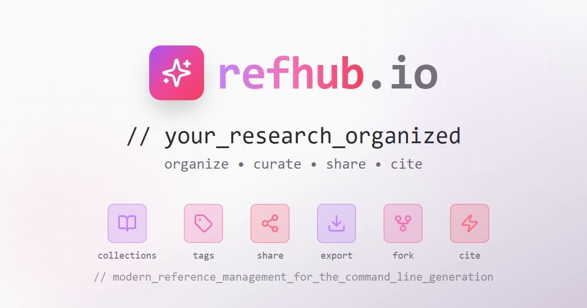

<div align="center">
  
</div>

# refhub.io

> a modern reference management platform for organizing academic publications, building citation networks, and sharing research collections.

[](https://refhub.io)
[](https://www.typescriptlang.org/)
[](https://reactjs.org/)
[](https://supabase.com/)

refhub lets you organize papers into vaults, tag them hierarchically, map citation relationships, and share collections with the research community. supports bibtex import/export and collaborative workflows.

## tech stack

```
frontend:     react 18 + typescript + vite
ui/styling:   tailwind css + shadcn/ui
backend:      supabase (postgresql + row level security + auth)
state:        tanstack query (react query)
routing:      react router v6
forms:        react hook form + zod
graphs:       react flow
charts:       recharts
```

## getting started

### prerequisites

- node.js 18+ or bun
- a supabase account for backend services

### installation

1. **clone the repository**
   ```bash
   git clone https://github.com/yourusername/refhub.io.git
   cd refhub.io
   ```

2. **install dependencies**
   ```bash
   # using npm
   npm install
   
   # or using bun
   bun install
   ```

3. **set up supabase**
   - create a new project at [supabase.com](https://supabase.com)
   - run the schema from `supabase/schema_consolidated.sql` in your supabase sql editor
   - copy your project url and anon key

4. **configure environment variables**
   create a `.env` file in the root directory:
   ```env
   VITE_SUPABASE_URL=your_supabase_project_url
   VITE_SUPABASE_ANON_KEY=your_supabase_anon_key
   ```

5. **start the development server**
   ```bash
   # using npm
   npm run dev
   
   # or using bun
   bun run dev
   ```

6. **open your browser**
   navigate to `http://localhost:5173`

## build & deploy

### build for production

```bash
# using npm
npm run build

# or using bun
bun run build
```

### deploy to github pages

```bash
npm run deploy
```

the built files will be in the `dist` directory and can be deployed to any static hosting service.

## project structure

```
refhub.io/
├── src/
│   ├── components/        # reusable ui components
│   │   ├── layout/       # layout components (sidebar, etc.)
│   │   ├── publications/ # publication-related components
│   │   ├── tags/         # tag management components
│   │   ├── vaults/       # vault management components
│   │   └── ui/           # shadcn/ui base components
│   ├── hooks/            # custom react hooks
│   ├── integrations/     # external service integrations
│   │   └── supabase/     # supabase client and queries
│   ├── lib/              # utility functions
│   ├── pages/            # page components
│   └── types/            # typescript type definitions
├── supabase/             # database schema and migrations
└── public/               # static assets
```

## contributing

contributions are welcome! please feel free to submit a pull request.

1. fork the repository
2. create your feature branch (`git checkout -b feature/AmazingFeature`)
3. commit your changes (`git commit -m 'Add some AmazingFeature'`)
4. push to the branch (`git push origin feature/AmazingFeature`)
5. open a pull request

## license

this project is open source and available under the [GPLv3](LICENSE).

## acknowledgments

built with [shadcn/ui](https://ui.shadcn.com/), powered by [supabase](https://supabase.com/), icons from [lucide](https://lucide.dev/).

## contact

for questions or feedback, please open an issue on github.

---

```
© 2026 refhub.io
```