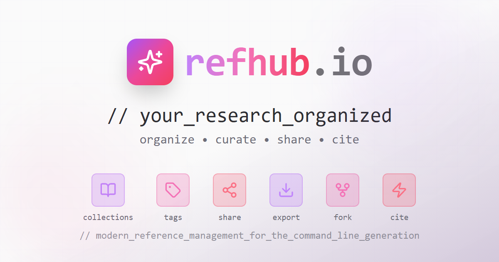

<div align="center">
  
</div>

# refhub.io

> // organize_papers • build_collections • map_citations

reference management for the command-line generation. organize papers into vaults, tag them hierarchically, map citation relationships, and share collections with collaborators. bibtex import/export, keyboard-first, dark by default.

[](https://refhub.io)
[](https://www.typescriptlang.org/)
[](https://reactjs.org/)
[](https://supabase.com/)

---

## // stack

```
frontend:     react 18 + typescript + vite 7
ui:           tailwind css + shadcn/ui (radix primitives + cva)
backend:      supabase (postgresql + rls + auth + realtime)
state:        tanstack query v5 + context api
routing:      react router v6
forms:        react hook form + zod
graphs:       react-force-graph-2d
charts:       recharts
fonts:        plus jakarta sans • jetbrains mono
```

---

## // setup

**prerequisites:** bun · supabase account

```sh
git clone https://github.com/refhub-io/refhub.io.git
cd refhub.io
bun install
```

set up supabase:
1. create a project at [supabase.com](https://supabase.com)
2. run `supabase/schema_consolidated.sql` in your supabase sql editor
3. copy your project url and anon key

configure env:

```sh
# .env
VITE_SUPABASE_URL=your_supabase_project_url
VITE_SUPABASE_PUBLISHABLE_KEY=your_supabase_anon_key
```

start dev server:

```sh
bun run dev
# → http://localhost:5173
```

---

## // build

```sh
bun run build       # production build → dist/
bun run deploy      # deploy to github pages
```

output in `dist/` — deploy to any static host.

---

## // structure

```
src/
├── components/
│   ├── ui/             # shadcn/ui primitives
│   ├── layout/         # shell components (sidebar, vault layout, theme toggle)
│   ├── publications/   # publication components
│   ├── tags/           # tag management
│   ├── vaults/         # vault management
│   ├── notifications/
│   └── profile/
├── contexts/           # react context providers (vault_content, keyboard)
├── hooks/              # custom hooks (use_auth, use_vault_access, ...)
├── integrations/       # supabase client and queries
├── lib/                # utilities (bibtex, export, tag_hierarchy, ...)
├── pages/              # route-level page components
├── types/              # typescript type definitions
└── config/             # kbd.config.ts — keybinding source of truth
supabase/               # schema and migrations
public/                 # static assets
```

---

## // contributing

1. fork the repo
2. create a feature branch: `git checkout -b feature/your_feature`
3. commit: `git commit -m 'feat: description'`
4. push: `git push origin feature/your_feature`
5. open a pull request

---

## // license

open source under [gplv3](LICENSE).

built with [shadcn/ui](https://ui.shadcn.com/) · powered by [supabase](https://supabase.com/) · icons from [lucide](https://lucide.dev/)
